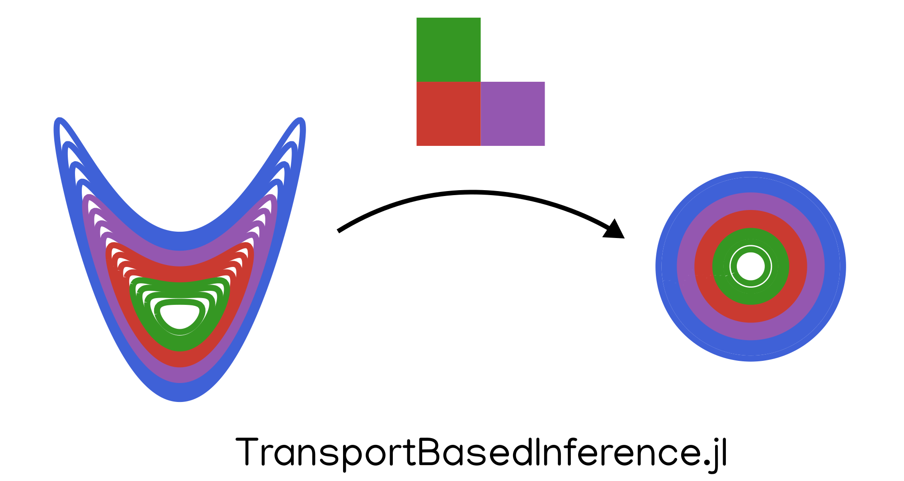

# TransportBasedInference.jl

*A Julia package for Bayesian inference with transport maps*



[](https://github.com/mleprovost/TransportBasedInference.jl/actions)


The objective of this package is to allow for easy and fast resolution of Bayesian inference problems using transport maps. The package provides tools for:
- joint and conditional density estimation from limited samples of the target distribution using the adaptive transport map algorithm developed by Baptista et al. [^1].
- sequential inference for state-space models using one of the following algorithms: the (localized) stochastic ensemble Kalman filter (Evensen [^2]), the ensemble transform Kalman filter (Bishop et al. [^3]) and a nonlinear generalization of the stochastic ensemble Kalman filter (Spantini et al. [^4]).


## Installation

**TransportBasedInference.jl** is registered in the general Julia registry. To install, type
e.g.,
```julia
] add TransportBasedInference
```

Then, in any version, type
```julia
julia> using TransportBasedInference
```

## Tutorials

For examples, consult the documentation or see the Jupyter notebooks in the examples folder.


## References

[^1]: Baptista, R., Zahm, O., & Marzouk, Y. (2020). An adaptive transport framework for joint and conditional density estimation. arXiv preprint arXiv:2009.10303.

[^2]: Evensen, G., 1994. Sequential data assimilation with a nonlinear quasi‐geostrophic model using Monte Carlo methods to forecast error statistics. Journal of Geophysical Research: Oceans, 99(C5), pp.10143-10162.

[^3]: Bishop, C.H., Etherton, B.J. and Majumdar, S.J., 2001. Adaptive sampling with the ensemble transform Kalman filter. Part I: Theoretical aspects. Monthly weather review, 129(3), pp.420-436.

[^4]: Spantini, A., Baptista, R., & Marzouk, Y. (2019). Coupling techniques for nonlinear ensemble filtering. arXiv preprint arXiv:1907.00389.

[^5]: Marzouk, Y., Moselhy, T., Parno, M., & Spantini, A. (2016). Sampling via measure transport: An introduction. Handbook of uncertainty quantification, 1-41.
